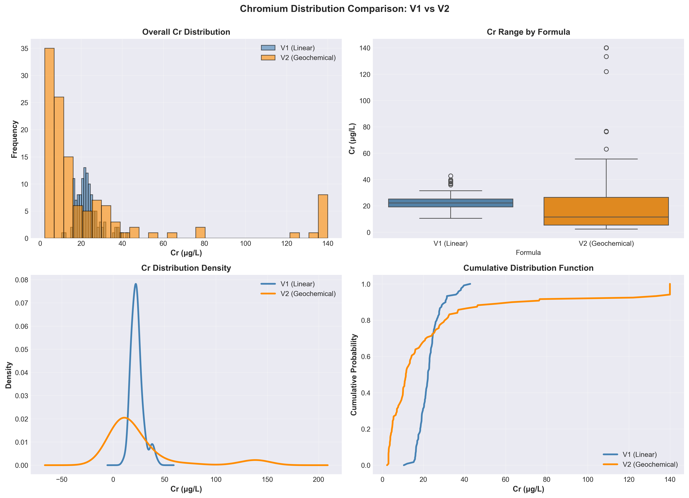
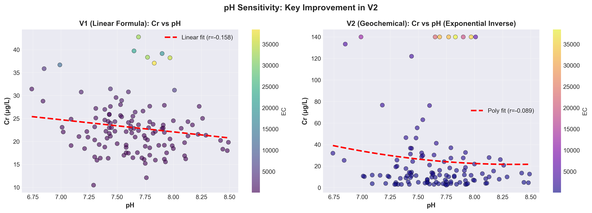
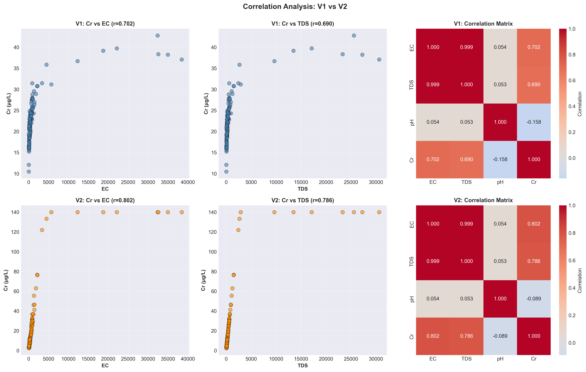
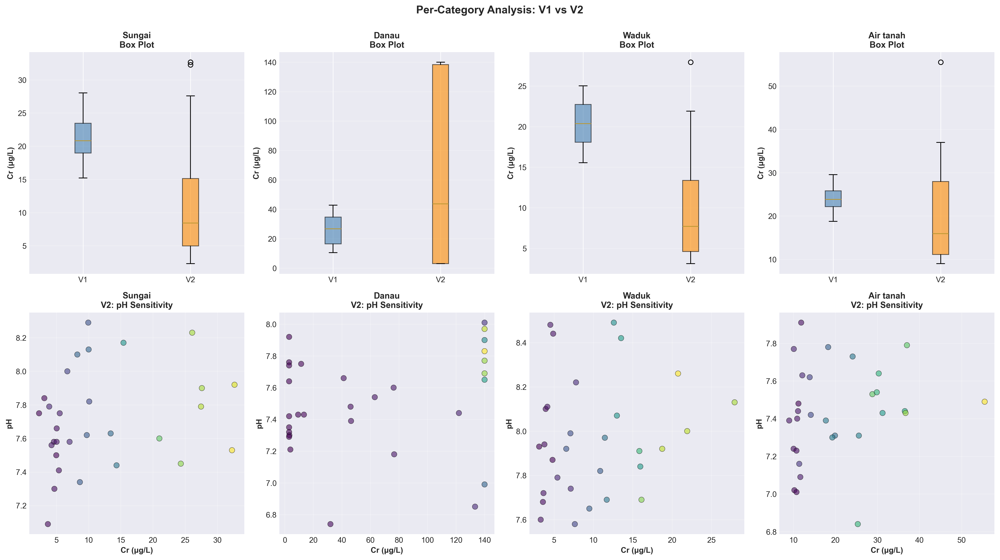
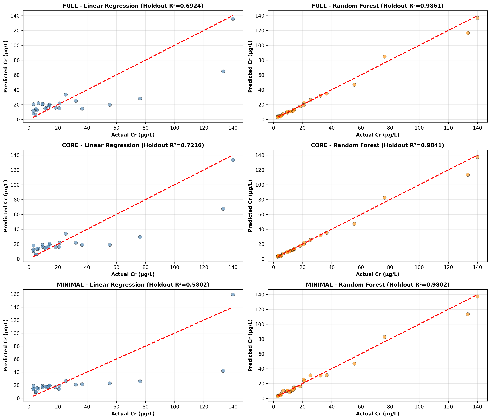
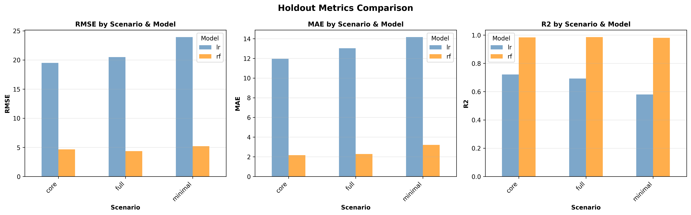
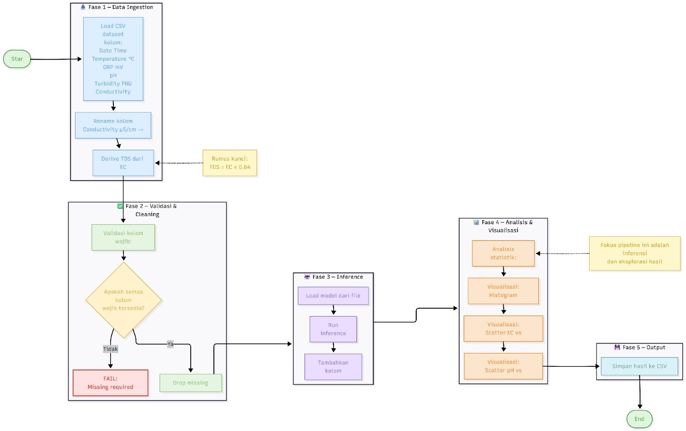
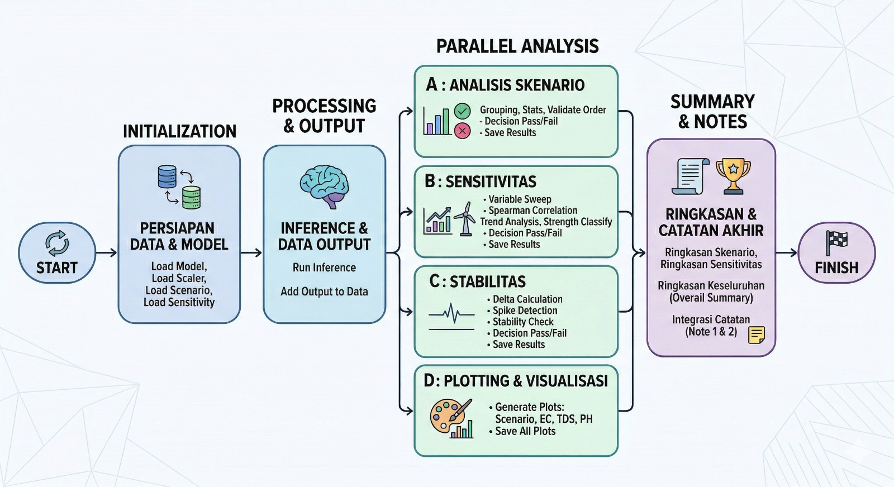

# README Dataset Synthetic Cr

Dokumen ini menjelaskan:
1. **bagaimana dataset synthetic dibuat**, dan  
2. **dari dataset riil mana rentang tiap parameter diambil**.

## 1. Ringkasan Hasil

Project ini memiliki 2 versi hasil synthetic:

1. `Dataset/Synthetic` (single-source, referensi utama GFQA_v3)
2. `Dataset/Synthetic_Multisource` (gabungan beberapa dataset riil)

## 1A. Visualisasi Perbandingan Formula V1 vs V2

Berikut visualisasi yang dihasilkan dari folder `image` untuk membandingkan formula synthetic Cr versi awal (V1) dan versi geochemical (V2).

### Gambar 1 - Distribusi Cr (V1 vs V2)


Penjelasan:
- V1 cenderung memiliki distribusi lebih sempit dan mirip Gaussian.
- V2 menunjukkan distribusi lebih realistis untuk polutan (right-skewed/log-normal) dengan rentang lebih lebar.
- Ini penting agar data synthetic lebih dekat dengan perilaku alami konsentrasi Cr di lapangan.

### Gambar 2 - Sensitivitas pH terhadap Cr


Penjelasan:
- Pada V2, relasi pH-Cr dibuat lebih geokimiawi: kondisi lebih asam cenderung meningkatkan kelarutan Cr.
- Perbaikan ini mengurangi masalah double-counting pengaruh pH yang ada pada formula lama.
- Hasilnya, respons model terhadap perubahan pH menjadi lebih konsisten secara ilmiah.

### Gambar 3 - Korelasi Antar Parameter


Penjelasan:
- Korelasi positif Cr terhadap `EC` dan `TDS` tetap dipertahankan.
- V2 memberikan pola korelasi yang lebih kuat dan masuk akal dibanding V1.
- Matriks ini membantu validasi bahwa hubungan antar fitur tidak acak.

### Gambar 4 - Analisis Kategori Perairan


Penjelasan:
- Menunjukkan perbedaan karakteristik Cr antar kategori perairan.
- Berguna untuk memastikan data synthetic tetap menghormati konteks domain (Sungai, Danau, Waduk, Air tanah, Akuakultur).
- Visual ini memudahkan pengecekan apakah rentang kategori sudah realistis.

## 1B. Plot Evaluasi Model (`results/plots`)

Berikut plot hasil evaluasi model dari folder `results/plots`.

### Plot 1 - Perbandingan Prediksi antar Model


Penjelasan:
- Plot ini membandingkan nilai prediksi Cr dari beberapa model terhadap data acuan.
- Tujuannya melihat model mana yang paling konsisten mengikuti pola nilai sebenarnya.
- Model yang kurvanya paling dekat terhadap referensi biasanya memiliki error lebih rendah.

### Plot 2 - Perbandingan Metrik Kinerja


Penjelasan:
- Menampilkan metrik evaluasi utama (misalnya `MAE`, `RMSE`, dan/atau `R2`) antar model.
- Membantu memilih model terbaik secara objektif, tidak hanya dari visual kurva prediksi.
- Plot ini melengkapi interpretasi pada tabel metrik di laporan hasil training.

## 1C. Contoh Output Menjalankan `example_soft_sensor_inference.py`

Perintah yang dijalankan:

```bash
python code/example_soft_sensor_inference.py
```

Cuplikan output aktual:

```text
EXAMPLE 1: Single Prediction from Sensor Dict
Sensor Input:
  EC............................ 1200
  TDS........................... 850
  pH............................ 6.8
  Suhu Air (°C)................. 26.5
  Suhu Lingkungan (°C).......... 28.3
  Kelembapan Lingkungan (%)..... 72.1
  Tegangan (V).................. 3.95

Predicted Cr: 42.49 μg/L

EXAMPLE 2: Batch Prediction from Sample Data
Prediction Statistics:
  Mean Cr:  37.73 μg/L
  Std Cr:   6.94 μg/L
  Min Cr:   27.31 μg/L
  Max Cr:   47.67 μg/L

EXAMPLE 3: Time-Series Monitoring Simulation
24-Hour Statistics:
  Avg Cr:        41.53 μg/L
  Peak Cr:       47.65 μg/L (Hour 6)
  Minimum Cr:    34.59 μg/L (Hour 18)
  Std Dev:       5.23 μg/L
  Range:         13.06 μg/L

EXAMPLE 4: Test Set Validation
Validation Metrics:
  MAE (Mean Absolute Error):     0.4840 μg/L
  RMSE (Root Mean Square Error): 1.0182 μg/L
  Mean % Error:                  2.99%
```

Penjelasan output:
- **Example 1 (single prediction):** menunjukkan cara inferensi satu data sensor real-time.
- **Example 2 (batch prediction):** memproses beberapa baris data sekaligus dan merangkum statistik prediksi.
- **Example 3 (time-series):** simulasi monitoring 24 jam untuk melihat dinamika Cr terhadap perubahan kondisi sensor.
- **Example 4 (validation):** membandingkan prediksi vs nilai aktual untuk mengukur akurasi model (`MAE`, `RMSE`, dan error persentase).

## 1D. Catatan Testing Dataset Ekstrem dan Pipeline yang Digunakan

Selain training dan evaluasi standar, project ini juga dipakai untuk **behavior testing** model Cr dengan dataset baru yang didesain lebih ekstrem (misalnya kondisi air bersih, air tercemar, sampai limbah/industrial-like).

Tujuan utamanya:
- menguji konsistensi respons model,
- mengecek arah tren fitur kunci,
- dan memastikan prediksi tetap stabil saat parameter sensor berubah.

### Rumus yang digunakan (derive TDS from EC)

Rumus turunan TDS dari EC yang dipakai pada proses testing:

`TDS = EC x 0.64`

Catatan satuan:
- Jika `EC` dalam `uS/cm`, maka `TDS` hasil konversi umum dipakai sebagai `mg/L` (aproksimasi untuk air alami).
- Faktor `0.64` adalah faktor empiris yang umum (dapat bervariasi menurut komposisi ionik air).

### Pipeline 1 (inference + analisis dataset real)



Ringkasan pipeline yang digunakan:
1. Load dataset CSV dengan kolom sensor (`Date Time`, `Temperature`, `ORP`, `pH`, `Turbidity`, `Conductivity`, `fDOM`).
2. Rename `Conductivity (uS/cm)` menjadi `EC`.
3. Buat kolom `TDS` dari `EC` dengan rumus `TDS = EC x 0.64`.
4. Validasi kolom `pH`, `EC`, `TDS`.
5. Drop missing values.
6. Load model `.pkl`.
7. Prediksi Cr dan simpan sebagai `Cr_predicted`.
8. Analisis statistik (`min`, `max`, `mean`, `std`) + visualisasi:
  - histogram `Cr_predicted`,
  - scatter `EC vs Cr_predicted`,
  - scatter `pH vs Cr_predicted`.
9. Simpan hasil ke file CSV baru.
10. Library: `pandas`, `numpy`, `matplotlib`, `joblib`.

### Pipeline 2 (behavior validation: scenario + sensitivity)



Ringkasan pipeline yang digunakan untuk file `code/test_model_behavior.py`:
1. Load model dari `models/best_model_rf_full.pkl` (+ scaler jika tersedia).
2. Load dataset testing:
  - `Dataset/TestScenarios/synthetic_cr_scenario_test.csv`
  - `Dataset/TestScenarios/synthetic_cr_sensitivity_test.csv`
3. Jalankan inference, tambah kolom `Cr_predicted` (dan `Error` opsional jika ada ground truth).
4. Scenario analysis:
  - group by `Scenario`,
  - hitung mean/min/max/std,
  - validasi urutan `Clean < Moderately Polluted < Highly Polluted < Extreme Industrial-like`,
  - beri flag `PASS/FAIL`,
  - simpan ke `results/testing/test_scenario_analysis.csv`.
5. Sensitivity analysis (`EC`, `TDS`, `pH`):
  - hitung korelasi Spearman dengan `Cr_predicted`,
  - validasi tren: `EC` positif, `TDS` positif, `pH` negatif,
  - klasifikasi kekuatan tren (`Strong/Moderate/Weak`),
  - simpan ke `results/testing/test_sensitivity_analysis.csv`.
6. Stability check:
  - cek delta antar baris,
  - deteksi spike saat perubahan output terlalu besar dibanding perubahan input.
7. Visualisasi ke `results/testing/plots/`:
  - scenario vs predicted Cr,
  - `EC vs Cr_predicted`,
  - `TDS vs Cr_predicted`,
  - `pH vs Cr_predicted`.
8. Final summary di console:
  - scenario `PASS/FAIL`,
  - trend `EC/TDS/pH` `OK/NOT OK`,
  - overall `VALID/NOT VALID`.

Implementasi modular yang dipakai:
- `load_model()`
- `load_data()`
- `run_inference()`
- `analyze_scenarios()`
- `analyze_sensitivity()`
- `check_stability()`
- `plot_results()`
- `main()`

Catatan: evaluasi ini fokus pada **validasi perilaku model** (konsistensi, monotonic trend, stabilitas), bukan evaluasi akurasi klasik seperti RMSE/MAE.

## 2. Cara Dataset Synthetic Dibuat

Semua dataset synthetic dibuat dengan alur umum berikut:

1. Identifikasi kategori perairan (mis. Sungai, Danau, Waduk, Air tanah, Akuakultur).
2. Ambil nilai parameter dari dataset riil.
3. Hitung rentang robust per kategori (utama: **p10-p90**, nilai normal: **p25-p75**).
4. Generate data synthetic baru (bukan copy data asli):
   - `EC` dibangkitkan dengan distribusi skewed/log-uniform.
   - `TDS` diturunkan dari `EC` (`TDS ~ EC x faktor konversi x noise kecil`).
   - `pH` dibangkitkan dalam rentang kategori.
   - `Suhu Air` dan `Suhu Lingkungan` dibentuk dengan variasi musiman + noise.
   - `Kelembapan` dan `Tegangan` dibentuk synthetic (karena tidak selalu ada di data riil).
   - `Cr` dibentuk sebagai target dari `EC`, `TDS`, dan `pH` dengan noise kecil.
5. Simpan file output + file QA korelasi.

## 3. Sumber Rentang Dataset Riil (Single-Source)

Folder output: `Dataset/Synthetic`

Sumber rentang:
- `Dataset/UNEP GEMSWater Global Freshwater Quality Archive/GFQA_v3`

Pemetaan variabel -> sumber riil:
- `EC` -> `Electrical_Conductance.csv`
- `TDS` -> `Water.csv` (Parameter Code: `TDS`)
- `pH` -> `pH.csv`
- `Suhu Air (°C)` -> `Temperature.csv` (Parameter Code: `TEMP`)
- `Suhu Lingkungan (°C)` -> `Temperature.csv` (Parameter Code: `TEMP-Air`)
- Kategori air -> `GEMStat_station_metadata.csv`

File hasil:
- `synthetic_cr_dataset.csv`
- `synthetic_cr_dataset_with_category.csv`
- `ringkasan_rentang_kategori_p10_p90.csv`
- `qa_korelasi_synthetic_cr.csv`

## 4. Sumber Rentang Dataset Riil (Multisource)

Folder output: `Dataset/Synthetic_Multisource`

Sumber riil yang dipakai:
1. `Dataset/UNEP GEMSWater Global Freshwater Quality Archive/GFQA_v3`
2. `Dataset/A Comprehensive Surface Water Quality Monitoring Dataset (1940-2023)/Dataset/Combined Data/Combined_dataset.csv`
3. `Dataset/Tabel 1 dalam dokumen Zenodo Nigeria/water_data.csv`
4. `Dataset/Water Quality Monitoring Dataset for Tilapia (Oreochromis niloticus) Aquaculture in Montería, Colombia (2024)/Monteria_Aquaculture_Data.csv`
5. `Dataset/Water Quality Pollution Indices for Heavy Metal Contamination Monitoring/Data.csv`

Pemetaan kontribusi rentang:
- **UNEP GFQA_v3**: sumber utama `EC`, `TDS`, `pH`, `Suhu Air`, `Suhu Lingkungan`, dan `Cr`.
- **A Comprehensive**: tambahan rentang `pH` dan `Suhu Air` (terutama Sungai dan Danau).
- **Nigeria**: tambahan rentang `pH` dan `TDS` (Air Permukaan dan Air Tanah).
- **Monteria**: tambahan kategori `Akuakultur` untuk `pH` dan `Suhu Air`.
- **Heavy Metal Indices**: tambahan referensi `Cr` (konteks sungai).

File hasil:
- `synthetic_cr_dataset_multisource.csv`
- `synthetic_cr_dataset_multisource_with_category.csv`
- `ringkasan_kontribusi_sumber_multisource.csv`
- `ringkasan_rentang_multisource_p10_p90.csv`
- `ringkasan_nilai_normal_multisource_p25_p75.csv`
- `qa_korelasi_multisource.csv`

## 5. Format Kolom Dataset Hasil

Urutan kolom utama (konsisten):

`Tanggal | Waktu | Tegangan (V) | Suhu Air (°C) | Suhu Lingkungan (°C) | Kelembapan Lingkungan (%) | TDS | EC | pH | Cr`

Catatan:
- `Cr` selalu di kolom terakhir.
- `Tegangan` dan `Kelembapan` adalah variabel synthetic yang dibuat realistis.

## 6. Dokumen Metodologi Lengkap

Detail lengkap ada di:
- `dokumentasi_pembuatan_dataset_synthetic_cr.md`
- `dokumentasi_pembuatan_dataset_synthetic_cr_multisource.md`
