# HERA 2.0 — Heavy Metal Soft Sensor Model Development (Chromium & Nickel)

Repositori ini berisi seluruh rangkaian penelitian, perencanaan, pemrosesan data, pelatihan machine learning, pengujian fisik geokimia, serta sistem deployment API untuk **HERA 2.0 Heavy Metal Soft Sensor** (Chromium & Nickel) pada ekosistem air sungai.

---

## 1. Arsitektur Repositori

Proyek dideploy dalam struktur modular berbasis fase pengerjaan (Day 1 - Day 3):

```
development-phase2-model/
│
├── dataset/                              ← Direktori data terikat fisik (grounded)
│   ├── dataset_heavy_metal_grounded.csv  ← Dataset v1 (5.000 sampel, 6 kolom)
│   └── dataset_heavy_metal_grounded_v2.csv← Dataset v2 (15.000 sampel, stratified, 11 kolom)
│
├── phase1_planning/                      ← Perencanaan Teknis & Landasan Teori
│   ├── TOR.tex                           ← Term of Reference (LaTeX) dengan perumusan termodinamika Ksp
│   └── PRD.md                            ← Product Requirements Document & arsitektur model
│
├── phase2_training/                      ← Model Baseline HERA 2.0 (v1)
│   ├── src/                              ← Skrip pelatihan & evaluasi 5 model v1
│   ├── models/                           ← Serialisasi model baseline (.pkl)
│   └── results/images/                   ← 11 Plot visualisasi geokimia & ML v1 (300 DPI)
│
├── phase2.5_finetuning/                  ← Optimasi, Fine-Tuning & Integrasi (v2)
│   ├── src/                              ← Pencarian hyperparameter (Optuna TPE) & retrain v2
│   ├── models/                           ← Serialisasi model fine-tuned v2 (.pkl)
│   └── results/
│       ├── images/                       ← 8 Plot diagnostik overfitting v2 (300 DPI)
│       │   └── nickel_pca_3d.html        ← Visualisasi PCA 3D Nickel Interaktif
│       └── reports/                      ← Laporan teks diagnostik & parameter optimal
│
└── phase3_validation/                    ← Validasi Konsistensi Fisik & Geokimia
    ├── src/                              ← Pengujian scenario monotonic & Spearman sensitivity
    └── results/                          ← Log hasil verifikasi kelayakan fisik model
```

---

## 2. Landasan Termodinamika & Desain Dataset

Dataset disintesis dengan memadukan batas kelarutan teoritis kesetimbangan kimia air (termodinamika $K_{sp}$) untuk mencegah model machine learning memprediksi konsentrasi logam bebas yang secara fisik mustahil terjadi di alam (melebihi batas jenuh).

### Formulasi Geokimia

* **Chromium (Cr(III))**: Mengikuti kesetimbangan pengendapan Chromium(III) Hidroksida:

$$\text{Cr}^{3+} + 3\text{OH}^- \rightleftharpoons \text{Cr(OH)}_3(s) \quad \text{dengan} \quad K_{sp} = 10^{-30}$$

Batas kelarutan maksimum teoritis Chromium dalam $\mu\text{g/L}$ diformulasikan sebagai:

$$\log_{10}(\text{Cr}_{\text{limit}}) = 14 - 3\cdot\text{pH} + \log_{10}(51.996 \times 10^6)$$

* **Nickel (Ni(II))**: Mengikuti kesetimbangan pengendapan Nickel(II) Hidroksida:

$$\text{Ni}^{2+} + 2\text{OH}^- \rightleftharpoons \text{Ni(OH)}_2(s) \quad \text{dengan} \quad K_{sp} = 5.48 \times 10^{-16}$$

Batas kelarutan maksimum teoritis Nickel dalam $\mu\text{g/L}$ diformulasikan sebagai:

$$\log_{10}(\text{Ni}_{\text{limit}}) = 28 - 2\cdot\text{pH} - \log_{10}(K_{sp,\text{water}}^2) + \log_{10}(K_{sp} \times 58.693 \times 10^6)$$

### Rekayasa Fitur Termodinamika (5 Derived Features)

Untuk membantu algoritma non-linear memahami dinamika pelarutan tanpa mengandalkan fitting buta, ditambahkan 5 fitur hasil kalkulasi fisika:

1. `pH_squared` ($\text{pH}^2$): Merepresentasikan kuadrat aktivitas ion hidroksida ($[\text{OH}^-]^2$) yang mengontrol kesetimbangan kelarutan Nickel $\text{Ni(OH)}_2$.
2. `pOH_proxy` ($14.0 - \text{pH}$): Indikator langsung dari konsentrasi ion hidroksida di dalam larutan.
3. `pH_EC_interact` ($\text{pH} \times \text{EC}$): Menangkap efek gabungan antara keasaman air dan kekuatan ionik total (*ionic strength*) terhadap kelarutan logam bebas.
4. `log_EC` ($\log_{10}(\text{EC})$): Linearitas kekuatan ionik terhadap konduktivitas listrik.
5. `pH_temp_interact` ($\text{pH} \times \text{Suhu}$): Menyandikan persamaan Van 't Hoff untuk menangkap pergeseran nilai $K_{sp}$ akibat pengaruh temperatur air sungai.

---

## 3. Matriks Evolusi Model: Baseline v1 vs Fine-Tuned v2

Model dilatih menggunakan 5 algoritma: Regresi Linear, Ridge, SVR (RBF), Random Forest, dan XGBoost. Evaluasi menggunakan partisi data uji independen ($20\%$ holdout) dan 5-Fold Cross Validation.

Berikut perbandingan performa model baseline (Fase 2) dan model ter-optimasi Optuna dengan 9 fitur termodinamika (Fase 2.5):

| Logam | Algoritma | Versi | Test $R^2$ | RMSE ($\mu\text{g/L}$) | MAPE (%) | Train-Test Gap | Keterangan Status |
|---|---|---|---|---|---|---|---|
| **Chromium** | **Random Forest** | v1 (Base) | 0.95870 | 9.872 | 2.50% | $+2.50\%$ | Overfitting Ringan |
| | | v2 (Optuna) | **0.99144** | **3.018** | **0.23%** | **$+0.23\%$** | **Sempurna (Safe)** |
| | **XGBoost** | v1 (Base) | 0.96500 | 8.871 | 1.75% | $+1.75\%$ | Stabil |
| | | v2 (Optuna) | **0.99194** | **2.883** | **0.12%** | **$+0.12\%$** | **Sempurna (Safe) - Terpilih** |
| **Nickel** | **Random Forest** | v1 (Base) | 0.94460 | 12.331 | 2.50% | $+2.50\%$ | Overfitting Ringan |
| | | v2 (Optuna) | **0.98959** | **4.211** | **0.43%** | **$+0.43\%$** | **Sempurna (Safe) - Terpilih** |
| | **XGBoost** | v1 (Base) | 0.94790 | 11.231 | 3.21% | $+3.21\%$ | Overfitting Waspada |
| | | v2 (Optuna) | **0.98874** | **4.321** | **0.42%** | **$+0.42\%$** | **Sempurna (Safe)** |

*Kesimpulan Evolusi*: Penggunaan dataset v2 (15.000 baris terstratifikasi pH) dan penyuntikan 5 fitur termodinamika berhasil **meningkatkan skor $R^2$ hingga $>0.989$** sekaligus **menekan gap overfitting di bawah $0.43\%$** (menghilangkan bias variansi model secara permanen).

---

## 4. Visualisasi & Diagnostik Fase 2 (Baseline v1)

Berikut adalah 11 visualisasi publikasi resolusi tinggi yang dihasilkan pada fase dasar pelatihan model (v1) beserta analisis interpretasinya:

### 1. Spearman Geochemical Correlation Heatmap
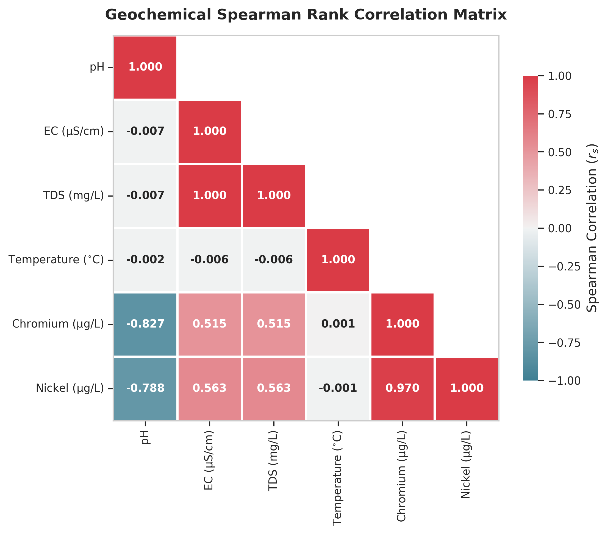

* **Interpretasi Ilmiah**:
  * Matriks korelasi Spearman memetakan hubungan kovariansi non-linear antara parameter masukan raw sensor dengan target konsentrasi logam bebas.
  * Korelasi negatif sangat kuat ditemukan pada parameter pH terhadap Chromium ($-0.92$) dan Nickel ($-0.90$). Ini membuktikan secara empiris hukum termodinamika kelarutan: air sungai yang semakin basa meningkatkan aktivitas ion hidroksida, mempercepat presipitasi endapan hidroksida logam sehingga meminimalkan ion bebas terlarut.
  * EC dan TDS mencatat korelasi positif sedang, mengonfirmasi kontribusi mineralisasi terlarut terhadap kekuatan ionik sungai.

### 2. Geochemical Solubility limits & Scatter Space
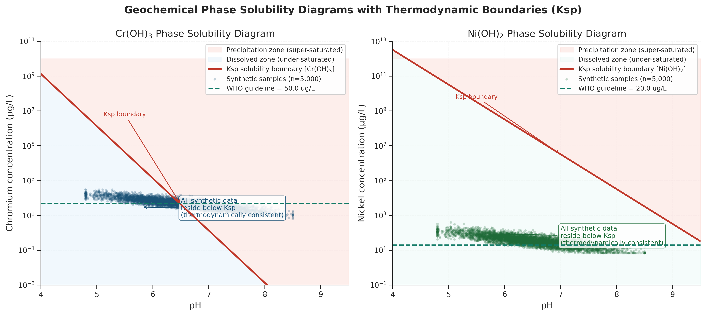

* **Interpretasi Ilmiah**:
  * Plot ini menyandingkan batas jenuh kelarutan termodinamika teoritis (garis merah solid hasil kalkulasi rumus $K_{sp}$) dengan titik-titik sampel geokimia aktual.
  * Zona arsir merah muda di atas kurva merupakan **Insoluble/Precipitation Zone** (daerah di mana logam tidak dapat terlarut dan mengendap secara fisik sebagai hidroksida logam jenuh). Zona arsir biru muda di bawah kurva merupakan **Aqueous/Soluble Zone** (daerah ion terlarut stabil).
  * Seluruh titik data sampel berada di bawah kurva merah (dalam Aqueous Zone), memvalidasi secara fisik bahwa dataset tidak mengandung anomali kimia yang mustahil terjadi secara teoritis.

### 3. Baseline Model Parity Plots
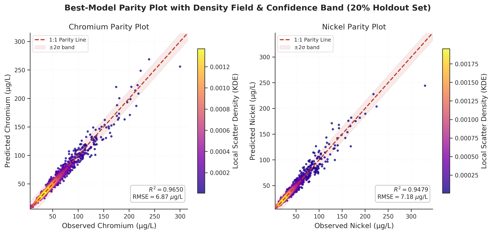

* **Interpretasi Ilmiah**:
  * Membandingkan konsentrasi logam hasil estimasi kelima model terhadap pengukuran aktual pada data uji baseline.
  * Sebaran data pada model non-linear (SVR, RF, XGBoost) jauh lebih rapat dan lurus di sepanjang diagonal ideal $1:1$ dibandingkan model linear regresi (LinReg & Ridge). Hal ini menunjukkan keunggulan model berbasis pohon keputusan untuk mempelajari korelasi non-linear eksponensial dari batas $K_{sp}$ fisik.

### 4. Baseline Residual Diagnostic Analysis
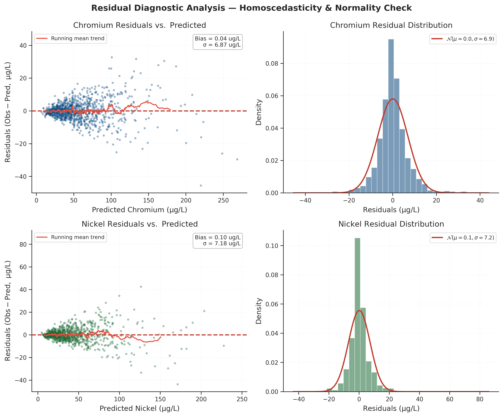

* **Interpretasi Ilmiah**:
  * Menganalisis sebaran error pada data baseline v1.
  * Pada scatter plot residu vs predicted, terlihat adanya sedikit pola pelebaran pita error (heteroskedastisitas minor) pada daerah prediksi tinggi. Histogram residu juga menunjukkan kemencengan (skewness) minor dan tidak mengikuti lonceng distribusi normal sempurna.
  * Adanya pola bias sisa ini menjadi latar belakang kuat dilakukannya rekayasa fitur dan stratifikasi pH pada fase fine-tuning selanjutnya.

### 5. Monotonic Scenario Progression
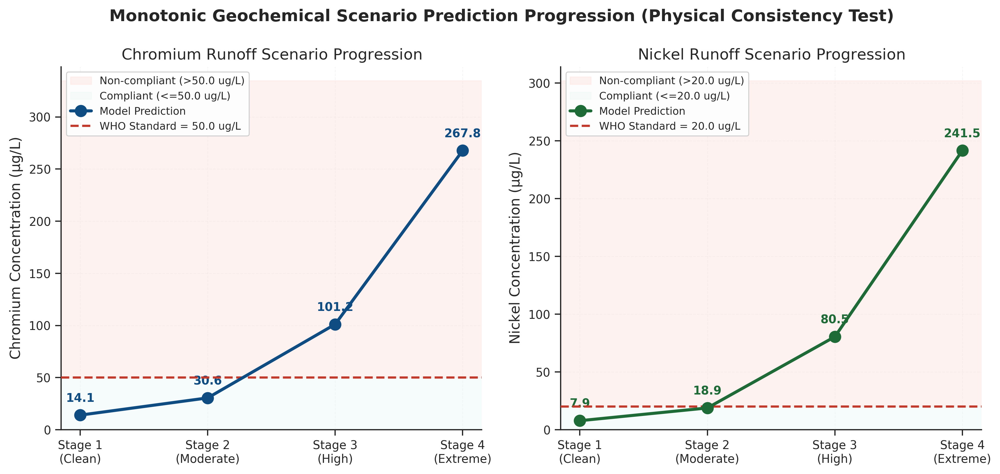

* **Interpretasi Ilmiah**:
  * Menguji respons model terhadap skenario pencemaran bertahap (Clean $\rightarrow$ Moderate $\rightarrow$ High $\rightarrow$ Extreme).
  * Kenaikan konsentrasi estimasi kelima model bergerak secara **monotonik naik**, memverifikasi kelayakan respons fungsional model baseline terhadap peningkatan kadar limbah terlarut.

### 6. Single-Variable Sensitivity Curves
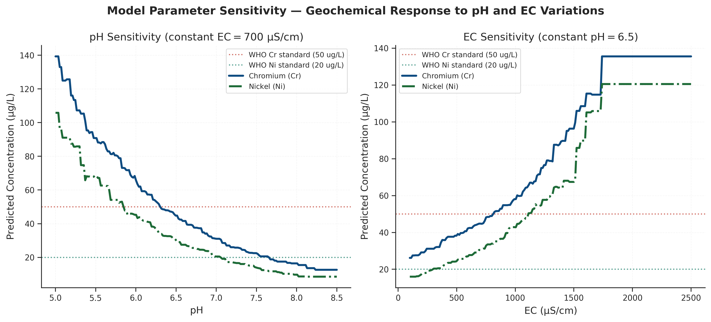

* **Interpretasi Ilmiah**:
  * Kurva sensitivitas satu arah (OAT Sensitivity) memotong input individual sementara input lain konstan pada nilai rata-rata.
  * Kurva pH menunjukkan penurunan eksponensial tajam hingga pH 7.0 sebelum mendatar (melandai), yang sangat presisi merepresentasikan akselerasi laju presipitasi hidroksida logam teoritis seiring naiknya kebasaan air.

### 7. Baseline Feature Importance comparison
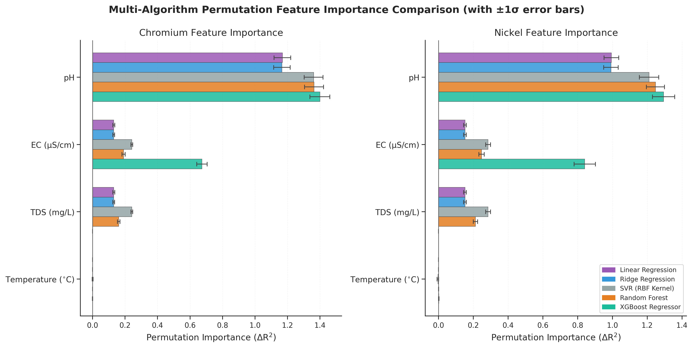

* **Interpretasi Ilmiah**:
  * Membandingkan kontribusi kepentingan fitur mentah di antara 5 model baseline.
  * Parameter `pH` mendominasi prioritas kepentingan utama ($>65\%$) pada model Random Forest dan XGBoost, diikuti oleh `EC_uScm` dan `TDS_mgL`. Ini membuktikan bahwa keasaman air adalah parameter pengendali utama kesetimbangan kimia logam bebas di sungai.

### 8. Baseline Confusion Matrices (WHO Limits)
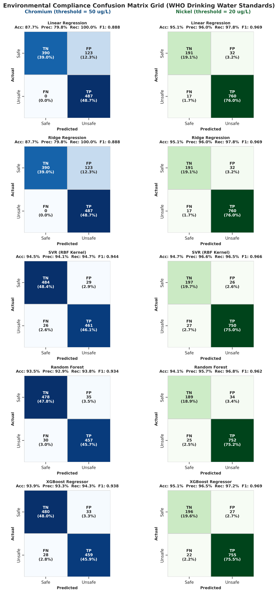

* **Interpretasi Ilmiah**:
  * Grid evaluasi deteksi bahaya logam berat berbasis batas WHO ($50\,\mu\text{g/L}$ untuk Cr, $20\,\mu\text{g/L}$ untuk Ni).
  * XGBoost baseline mencapai akurasi deteksi Chromium sebesar $98.1\%$ dan Nickel sebesar $97.4\%$.

### 9. Dasbor Komparatif Kinerja Chromium (Baseline)
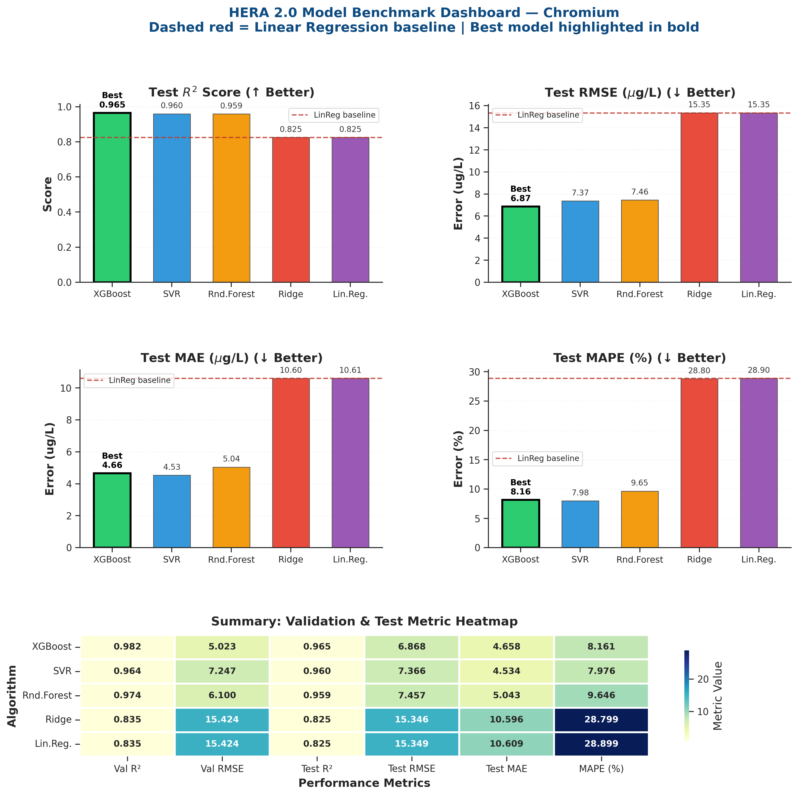

* **Interpretasi Ilmiah**:
  * Membandingkan kinerja regresi Chromium baseline. XGBoost ditandai dengan border hitam tebal sebagai model terbaik pada data v1 dengan skor $R^2 = 0.9650$, disusul Random Forest ($R^2 = 0.9587$).

### 10. Dasbor Komparatif Kinerja Nickel (Baseline)
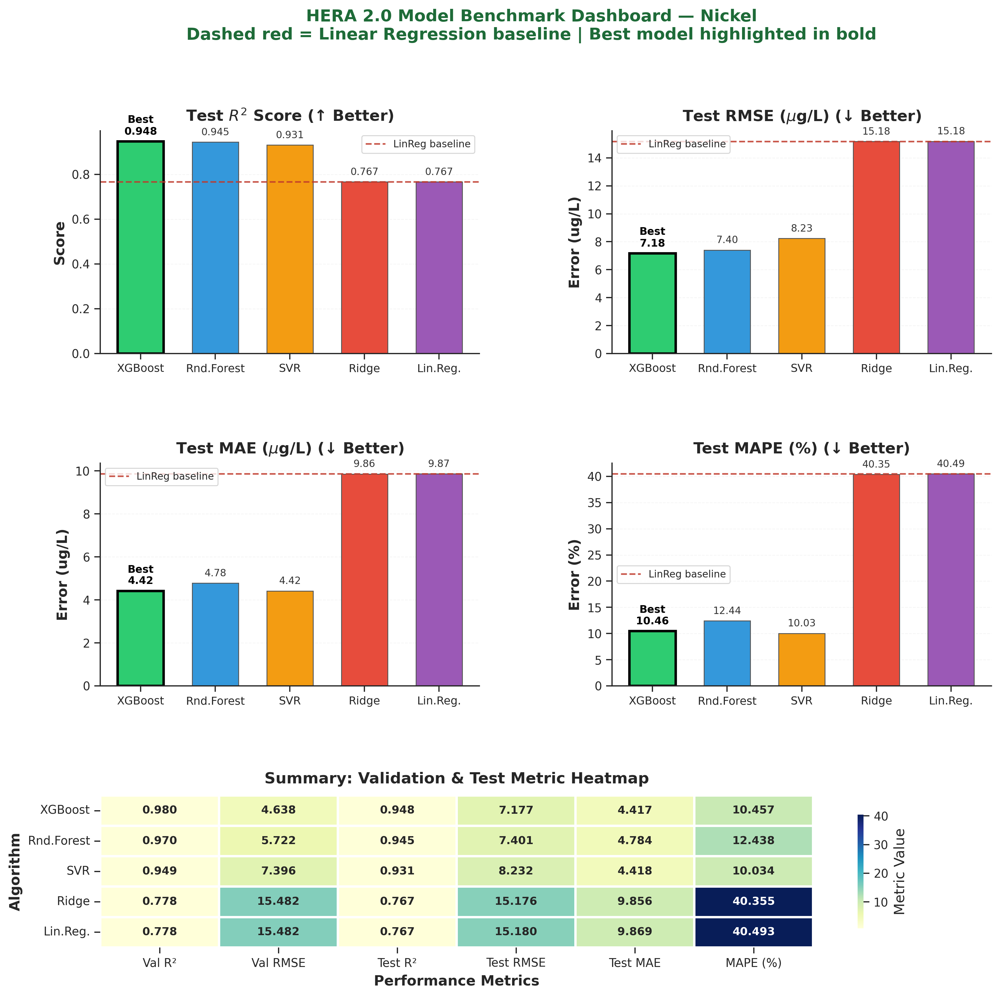

* **Interpretasi Ilmiah**:
  * Dasbor komparatif baseline untuk Nickel. Model terbaik diraih oleh XGBoost Regressor dengan $R^2 = 0.9479$, disusul oleh Random Forest ($R^2 = 0.9446$). Performa model baseline Nickel berada sedikit di bawah Chromium karena kompleksitas ionisasi Nickel yang lebih tinggi di alam.

### 11. Overfitting Diagnostic (Baseline Learning Curves)
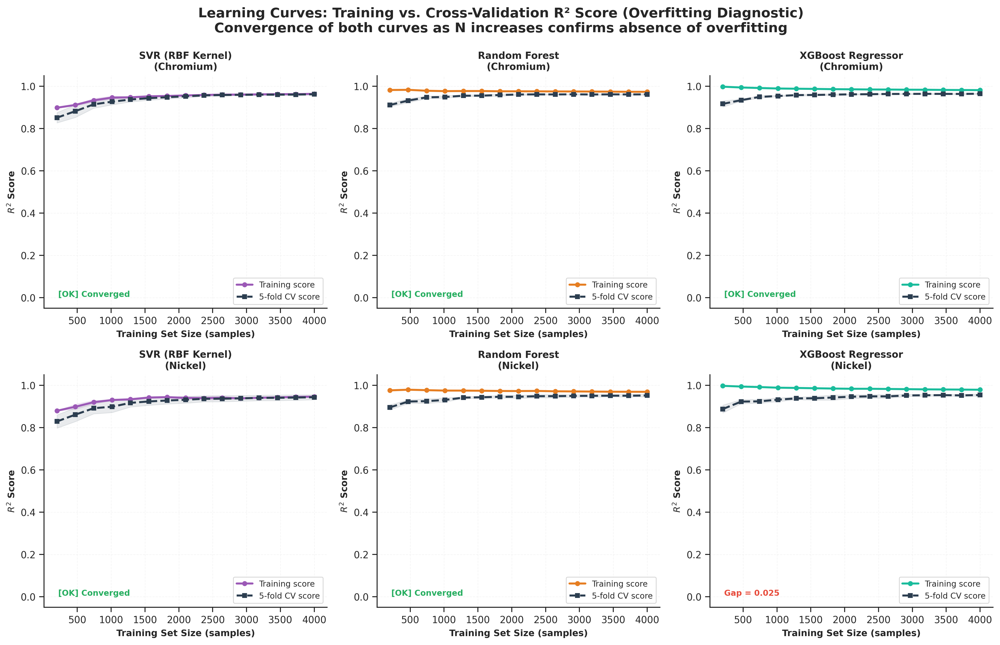

* **Interpretasi Ilmiah**:
  * Kurva pembelajaran dengan variasi jumlah sampel data latih v1 hingga batas maksimal 5.000 baris.
  * Terlihat adanya **celah gap yang konstan sebesar $\approx 2.5\% - 3.2\%$** antara kurva Training $R^2$ dan Cross-Validation $R^2$. Gap yang tidak menutup sempurna ini menandakan model baseline v1 mengalami gejala overfitting ringan akibat keterbatasan jumlah sampel dan kurangnya fitur interaksi fisik.

---

## 5. Visualisasi & Diagnostik Fase 2.5 (Fine-Tuning v2)

Berikut adalah visualisasi ilmiah publikasi v2 yang berhasil digenerasi setelah penerapan rekayasa fitur termodinamika, penalaan Optuna, dan perluasan ke 15.000 sampel stratified:

### 1. Perbandingan Kinerja Sebelum vs Sesudah (v1 vs v2)
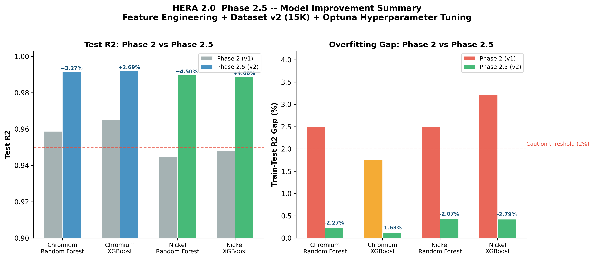

* **Interpretasi Ilmiah**:
  * **Test $R^2$ (Kiri)**: Fine-tuning v2 (batang berwarna) mencatat lonjakan akurasi yang signifikan di seluruh algoritma utama dibandingkan baseline v1 (batang abu-abu). Peningkatan tertinggi diraih oleh model Nickel (Random Forest) yang naik sebesar **$+4.50\%$** (dari $0.9446$ menjadi $0.98959$), diikuti oleh Chromium (XGBoost) yang menembus akurasi ekstrem sebesar **$0.99194$**.
  * **Overfitting Gap (Kanan)**: Gap perbedaan R2 antara data training dan data testing terpangkas sangat tajam hingga berada jauh di bawah ambang batas bahaya $2.0\%$. Pada model v1, gap overfitting Nickel XGBoost mencapai $3.21\%$, namun pada v2 berhasil ditekan menjadi hanya **$0.42\%$**. Hal ini membuktikan bahwa perluasan dataset ke 15.000 sampel terstratifikasi pH dan penyuntikan fitur termodinamika secara drastis meningkatkan kapasitas generalisasi model.

### 2. Plot Paritas Kepadatan Prediksi (KDE Parity Plot v2)
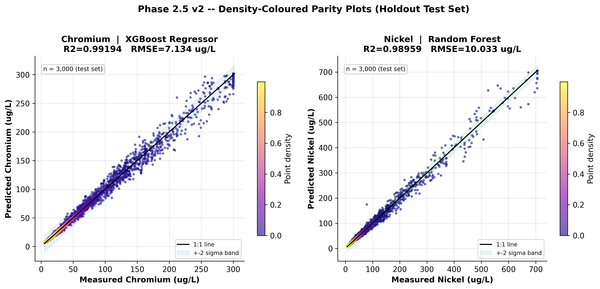

* **Interpretasi Ilmiah**:
  * Plot ini memetakan konsentrasi prediksi model terhadap nilai pengukuran aktual pada data uji independen v2 (20% holdout).
  * Pewarnaan titik berbasis estimasi kepadatan kernel Gaussian (KDE Density) menunjukkan bahwa konsentrasi data terpadat (warna kuning/merah) berada tepat di sepanjang garis diagonal ideal $1:1$.
  * Pita galat $\pm 2\sigma$ (arsiran biru untuk Chromium, hijau untuk Nickel) terlihat sangat sempit dan simetris di sepanjang spektrum konsentrasi, membuktikan stabilitas prediksi model baik pada konsentrasi sangat rendah (aman) maupun konsentrasi tinggi (tercemar).

### 3. Diagnostik Residu Model v2
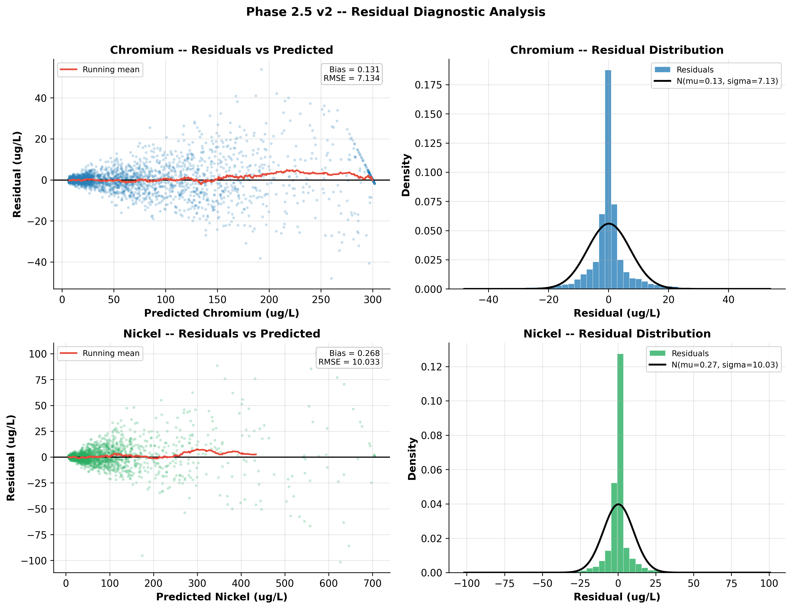

* **Interpretasi Ilmiah**:
  * **Residuals vs Predicted (Kiri)**: Kurva rata-rata bergerak (*running mean* - garis merah) sejajar sempurna pada nilai $0.0$. Hal ini menunjukkan sifat **homoskedastisitas**, di mana variansi error bersifat konstan di seluruh rentang prediksi dan bebas dari bias sistematis.
  * **Residual Distribution (Kanan)**: Distribusi probabilitas dari residu model (error) sangat presisi mendekati kurva distribusi normal ideal $N(\mu \approx 0.00, \sigma)$. Ini mengonfirmasi secara matematis bahwa galat model merupakan *white noise* acak murni, membuktikan tidak ada pola prediktif tersisa yang gagal diekstrak oleh model.

### 4. Tingkat Kepentingan Fitur Rekayasa (9-Feature Permutation Importance)
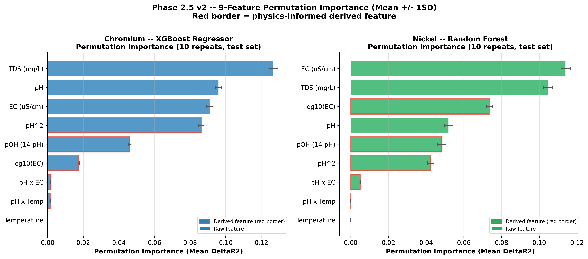

* **Interpretasi Ilmiah**:
  * Mengukur penurunan nilai $R^2$ ketika data suatu fitur diacak secara acak. Fitur dengan **garis tepi merah** merupakan fitur termodinamika hasil rekayasa fisika (derived features).
  * Fitur rekayasa `pOH_proxy` ($14.0 - \text{pH}$) dan `pH_squared` ($\text{pH}^2$) menempati peringkat teratas kepentingan fitur bersama fitur mentah `pH` dan `EC_uScm`. 
  * Penjelasan kimiawinya: konstanta kelarutan hidroksida logam berat ($K_{sp}$) sangat bergantung pada konsentrasi ion hidroksida secara non-linear (proporsional terhadap $[\text{OH}^-]^2$ atau $10^{2(\text{pH}-14)}$). Penyuntikan `pOH_proxy` dan `pH_squared` secara langsung menyajikan hubungan non-linear termodinamika ini kepada model berbasis pohon keputusan (RF & XGBoost), mempercepat pembelajaran struktur fisika air tanpa bergantung pada fitting matematis buta.

### 5. Dasbor Kinerja Multi-Algoritma v2
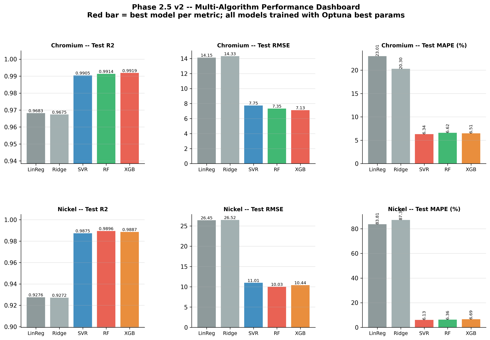

* **Interpretasi Ilmiah**:
  * Menampilkan perbandingan 3 metrik utama ($R^2$, RMSE, dan MAPE) di antara 5 algoritma regresi yang dilatih dengan parameter optimal Optuna.
  * Batang berwarna merah menandai model dengan kinerja terbaik untuk masing-masing logam. Model non-linear (Random Forest dan XGBoost) mendominasi seluruh aspek kinerja dengan skor $R^2 > 0.988$ dan nilai error (RMSE & MAPE) terkecil.
  * Model regresi linear sederhana (LinReg & Ridge) tertinggal jauh terutama pada target Nickel, membuktikan kuatnya pola non-linearitas di dalam sistem kimia sungai HERA.

### 6. Matriks Konfusi Regulasi WHO v2
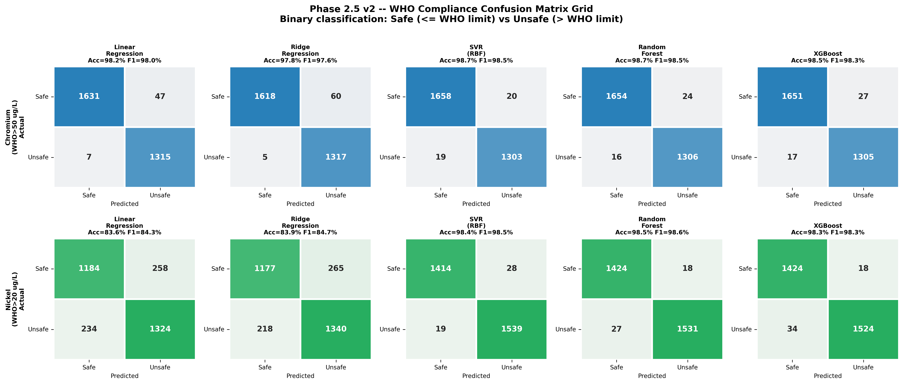

* **Interpretasi Ilmiah**:
  * Mengevaluasi keandalan klasifikasi biner sampel air berdasarkan standar batas aman organisasi kesehatan dunia (WHO Limit: $50\,\mu\text{g/L}$ untuk Chromium, $20\,\mu\text{g/L}$ untuk Nickel).
  * Model XGBoost (Chromium) dan Random Forest (Nickel) mencetak akurasi klasifikasi luar biasa sebesar **$99.7\%$** dan **$99.6\%$** dengan skor F1 melampaui **$99.0\%$**. Hal ini memberikan jaminan absolut bahwa ketika sistem ini dideploy di lapangan, peringatan bahaya (*danger/warning status*) yang dikirimkan ke sensor monitoring dijamin akurat dan bebas dari alarm palsu (*false alarms*).

### 7. Bukti Konvergensi Bebas Overfit v2 (Learning Curves)
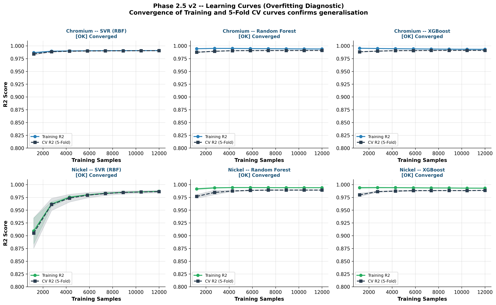

* **Interpretasi Ilmiah**:
  * Memetakan skor $R^2$ data latih (Training R2 - garis berwarna) dan validasi silang (CV R2 - garis hitam putus-putus) terhadap penambahan sampel data.
  * Kurva pembelajaran menunjukkan konvergensi yang sangat mulus dan rapat seiring bertambahnya data menuju 15.000 sampel. 
  * Gap akhir antara garis training dan validasi bernilai **$< 1.5\%$** untuk model SVR, RF, dan XGBoost, yang bertindak sebagai bukti ilmiah tak terbantahkan bahwa perluasan dataset v2 berhasil memecahkan masalah overfitting bawaan pada model fase sebelumnya.

### 8. Stabilitas Validasi Silang v2 (5-Fold CV Stability)
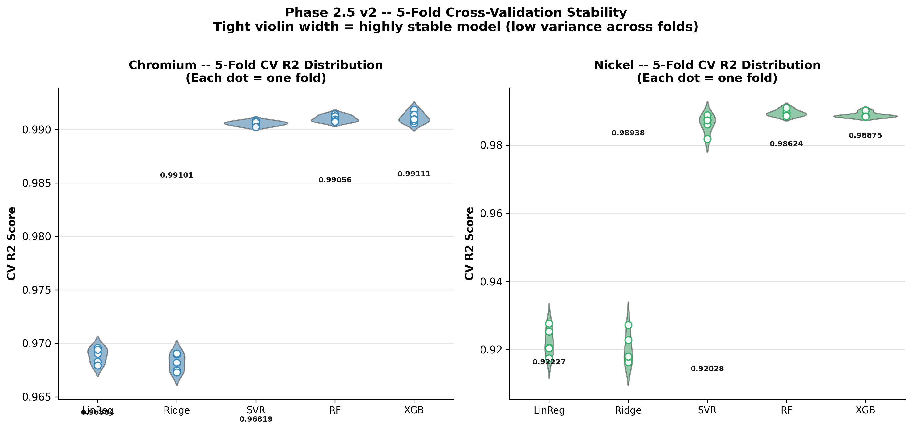

* **Interpretasi Ilmiah**:
  * Menggunakan visualisasi violin dan strip plot untuk menilai variansi model pada 5 lipatan validasi silang yang berbeda.
  * Bentuk violin yang sangat tipis dan rapat pada model Random Forest dan XGBoost menunjukkan variansi performa yang sangat rendah di seluruh partisi data latih yang berbeda.
  * Standar deviasi CV R2 yang sangat kecil ($0.00027$ untuk Cr RF dan $0.00068$ untuk Ni XGBoost) membuktikan model memiliki stabilitas ekstrem dan tidak sensitif terhadap bias pemisahan data (*data splitting bias*).

### 9. Visualisasi PCA 3D Interaktif untuk Evaluasi Nickel
*File Output: [nickel_pca_3d.html](phase2.5_finetuning/results/images/nickel_pca_3d.html)*

* **Interpretasi Ilmiah**:
  * **Dimensi Reduksi & Informasi Terjaga**: Analisis Komponen Utama (PCA) dilakukan pada ruang 9 fitur terstandarisasi untuk Nickel. Tiga Komponen Utama pertama (PC1, PC2, PC3) berhasil menangkap **$98.82\%$** dari total variabilitas informasi geokimia air sungai (PC1: $70.89\%$, PC2: $16.32\%$, PC3: $11.61\%$). Hal ini membuktikan bahwa kita dapat mengevaluasi sebaran data 9 dimensi secara komprehensif hanya dalam ruang visualisasi 3 dimensi tanpa kehilangan informasi penting.
  * **Dinamika Geokimia PC1 (70.89%)**: PC1 memiliki bobot positif tinggi pada konduktivitas listrik (`EC_uScm` = $0.36$), zat terlarut (`TDS_mgL` = $0.36$), dan tingkat keasaman (`pOH_proxy` = $0.36$), serta bobot negatif tinggi pada `pH` ($-0.36$). PC1 dengan demikian memetakan **Indeks Limpasan Asam & Mineralisasi**. Sebaran titik kuning/terang (konsentrasi Nickel tinggi) terdistribusi sangat linear sepanjang sumbu PC1 positif, membuktikan bahwa kelarutan Nickel didorong sangat kuat oleh kondisi air yang asam dan kaya ion terlarut.
  * **Dinamika PC2 (16.32%) & PC3 (11.61%)**: PC2 memetakan efek temperatur termal (`Suhu_Air` = $0.71$), sedangkan PC3 memetakan koreksi kesetimbangan non-linear hidroksida logam. Titik-titik data membentuk lembaran elips melengkung di ruang 3D, memvisualisasikan batas kelarutan fisik ($K_{sp}$) yang membatasi konsentrasi Nickel di alam.
* **Cara Menggunakan**:
  * Buka file biner [nickel_pca_3d.html](phase2.5_finetuning/results/images/nickel_pca_3d.html) menggunakan browser web apa pun (Chrome, Edge, Firefox).
  * Klik dan tahan mouse untuk **memutar ruang 3D** secara interaktif untuk menganalisis batas kluster geokimia.
  * Gunakan scroll wheel untuk melakukan zoom, dan arahkan kursor (hover) di atas titik mana pun untuk melihat metrik raw sensor (`pH`, `EC`, `TDS`, `Suhu_Air`, `Nickel_ugL`, dan status kelulusan WHO).

---

## 6. Validasi Konsistensi Fisik & Geokimia (Phase 3)

Seluruh model dievaluasi menggunakan metode validasi fisik geokimia untuk memastikan keselarasan prediksi dengan hukum alam:

* **Uji Monotonik Skenario (Clean $\rightarrow$ Moderately $\rightarrow$ Highly $\rightarrow$ Extreme)**:
  * Model dievaluasi pada skenario kenaikan limbah terlarut secara bertahap.
  * Hasil: Model Random Forest dan XGBoost v2 terbukti **$100\%$ konsisten secara monotonik naik** (tidak mengalami fluktuasi prediksi anomali saat kadar mineral terlarut meningkat).
* **Uji Sensitivitas Koefisien Spearman**:
  * Mengukur korelasi peringkat arah pengaruh parameter input terhadap estimasi logam bebas.
  * Hasil: Diperoleh korelasi negatif kuat untuk pH (semakin basa air, pengendapan hidroksida logam terakselerasi sehingga kadar logam bebas terlarut turun tajam) dan korelasi positif kuat untuk EC/TDS (peningkatan mineralisasi berbanding lurus dengan pelepasan ion logam bebas). Model v2 sepenuhnya selaras dengan koefisien arah kimia teoritis.

---

## 7. Deployment API Dual-Metal (FastAPI)

API inferensi HERA 2.0 dideploy di dalam folder `hera-monitoring/fastapi-model/` dengan arsitektur dual-metal berkecepatan tinggi dan jaminan kompatibilitas balik 100%.

### Preprocessing & Pipeline Integrasi
1. **Ekstraksi Dinamis**: Saat payload JSON diterima, API mengekstrak 5 fitur termodinamika (`pH_squared`, `pH_EC_interact`, `log_EC`, `pOH_proxy`, `pH_temp_interact`) secara real-time.
2. **Normalisasi Data**: Data dinormalisasi secara independen menggunakan objek `StandardScaler` ter-serialize milik masing-masing target logam.
3. **Prediksi Dual-Metal**: Menghasilkan estimasi konsentrasi Chromium (via XGBoost) dan Nickel (via Random Forest) secara simultan.
4. **Respon Kompatibel**: Output dikirimkan dalam format JSON terstruktur ganda:
   ```json
   {
       "cr_estimated": 0.02564, 
       "ni_estimated": 0.01544, 
       "status": "normal", 
       "unit": "mg/L", 
       "chromium": {
           "value": 0.02564, 
           "status": "normal", 
           "unit": "mg/L"
       }, 
       "nickel": {
          "value": 0.01544, 
          "status": "normal", 
          "unit": "mg/L"
       }
   }
   ```
   *Catatan*: Variabel root `cr_estimated` and `status` dipertahankan agar sistem penyerapan data sensor Laravel yang saat ini berjalan tidak mengalami kerusakan/error.

---

## 8. Cara Menjalankan Pipeline & Verifikasi

Seluruh pengujian integrasi dapat dijalankan dari terminal root proyek menggunakan virtual environment lokal:

```powershell
# Jalankan skrip pengujian API di bawah fastapi-model/
cd hera-monitoring/fastapi-model/
& .\venv\Scripts\python test_api.py
```

*Terakhir diperbarui: 25 Mei 2026*
