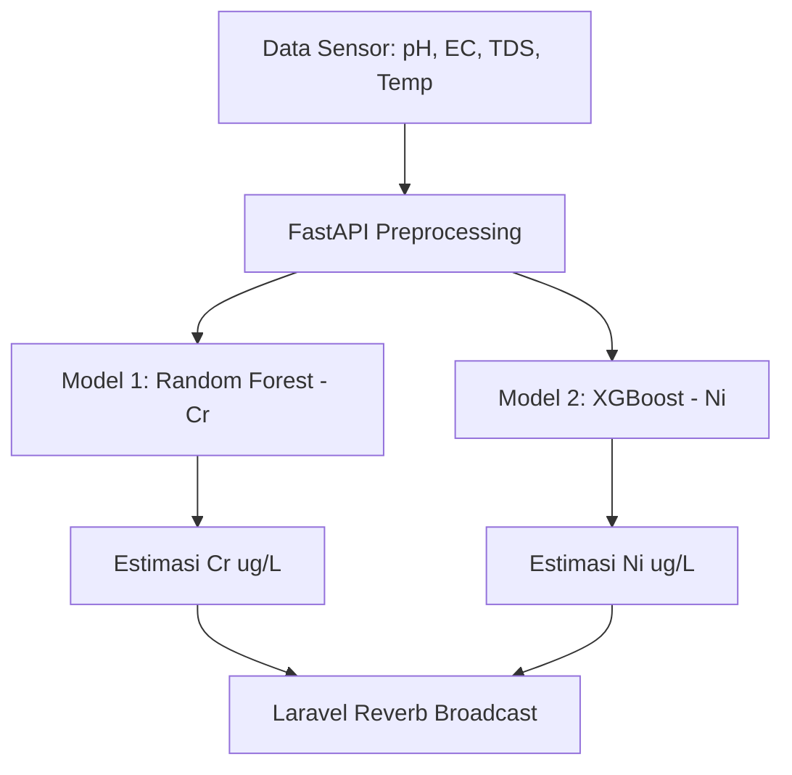
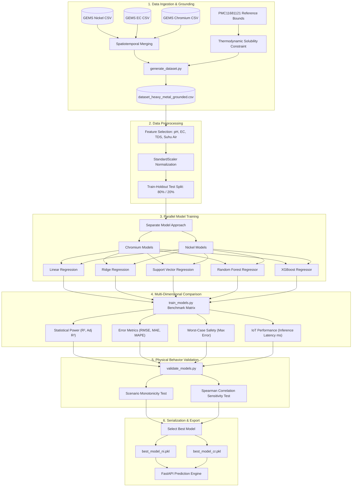
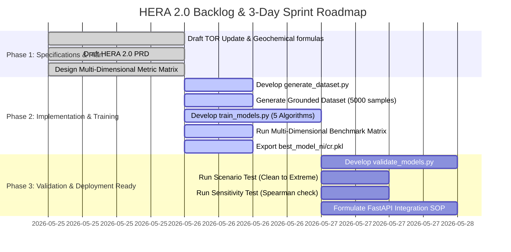

# PRODUCT REQUIREMENT DOCUMENT (PRD)
## HERA 2.0: IoT Multi-Heavy Metal Soft Sensor Monitoring System

---

## 1. PENDAHULUAN & LATAR BELAKANG
Sistem pemantauan kualitas air konvensional umumnya memerlukan sensor elektroda selektif ion (ISE) atau pengujian laboratorium berbasis AAS (Atomic Absorption Spectroscopy) yang sangat mahal, lambat, destruktif, dan sulit dipasang secara luas di lapangan.

**HERA 2.0** memecahkan masalah ini dengan pendekatan **Soft Sensor (Virtual Sensor)** berbasis kecerdasan buatan (Machine Learning). Sistem memanfaatkan kombinasi sensor parameter fisis sederhana—**Daya Hantar Listrik (EC), Total Dissolved Solids (TDS), Derajat Keasaman (pH), dan Temperatur Air**—untuk mengestimasi konsentrasi logam berat terlarut secara simultan dan non-destruktif.

Fokus perluasan HERA 2.0 adalah mendukung pemantauan logam berat ganda:
1.  **Kromium (Cr)** (telah dikembangkan pada fase 1 menggunakan dataset sintetis terkalibrasi).
2.  **Nikel (Ni)** (fokus utama fase 2 menggunakan data aktual global/riil).

---

## 2. LANDASAN ILMIAH & GEOKIMIAWI (GEOCHEMICAL FRAMEWORK)
Perilaku kelarutan logam kationik seperti Nikel ($Ni$) dan spesies Kromium ($Cr$) sangat bergantung pada karakteristik termodinamika perairan:

### A. Geokimia Nikel ($Ni$)
*   **Spesiasi:** Dalam perairan alami, nikel sebagian besar berada dalam bentuk ion bebas divalent terlarut ($Ni^{2+}$).
*   **Ketergantungan pH:** Kelarutan nikel berbanding terbalik secara eksponensial terhadap kenaikan pH. Pada pH netral hingga basa (pH $> 8{,}0$), kelarutan nikel turun drastis karena bereaksi dengan ion hidroksida ($OH^-$) membentuk endapan nikel hidroksida ($Ni(OH)_2$) yang tidak larut:
    $$Ni^{2+} + 2OH^- \rightleftharpoons Ni(OH)_2(s) \quad (K_{sp} \approx 5{,}48 \times 10^{-16})$$
*   **Korelasi Fisis:** Pada pH asam (pH $< 6{,}5$), kelarutan $Ni^{2+}$ sangat tinggi. Kation bebas terlarut ini secara langsung berkontribusi meningkatkan daya hantar listrik (Electrical Conductivity/EC) dan TDS cairan.
*   **WHO Safety Limit:** Baku mutu WHO menetapkan batas aman Nikel dalam air minum adalah **$0{,}02\text{ mg/L}$ ($20\,\mu\text{g/L}$)**.

### B. Geokimia Kromium ($Cr$)
*   **Spesiasi:** Kromium umumnya berada dalam bentuk Cr(III) (kation terlarut) atau Cr(VI) (anion terlarut seperti kromat $CrO_4^{2-}$).
*   **Korelasi Fisis:** Kelarutannya dipengaruhi oleh tingkat redoks air dan keasaman (pH), dengan kecenderungan peningkatan kelarutan total pada pH asam.
*   **WHO Safety Limit:** Batas aman Kromium adalah **$0{,}05\text{ mg/L}$ ($50\,\mu\text{g/L}$)**.

---

## 3. ARSITEKTUR MULTI-MODEL: SEPARATE MODEL APPROACH (ONE-BY-ONE)
Untuk menghasilkan tingkat akurasi optimal, HERA 2.0 menggunakan **Separate Model Approach (One-by-One)** alih-alih model *multi-output*.



**Alasan Utama:**
1.  **Respon Kelarutan Berbeda:** Karakteristik kelarutan masing-masing logam berbeda (kationik $Ni^{2+}$ vs spesiasi $Cr$ yang kompleks). Model tunggal multi-output dapat mengalami distorsi gradient path selama training.
2.  **Modularitas:** Memudahkan penambahan parameter logam berat baru (misal Pb atau Cd) di masa depan tanpa melatih ulang model logam yang sudah stabil.

---

## 4. METODOLOGI & RANCANGAN DATASET SINTETIS ACUAN (GROUNDED SYNTHETIC DATASET DESIGN)

Untuk menjamin kontrol kualitas model fisis, menghilangkan noise instrumen berlebih, serta memastikan keselarasan penuh dengan batas fisik-kimia air, HERA 2.0 merancang **Grounded Physics-Informed Synthetic Dataset** yang terkalibrasi langsung menggunakan acuan statistik dari **UNEP GEMS/Water Archive** dan publikasi ilmiah **Nature Scientific Reports (PMC11681121)**.

### A. Acuan Statistik Distribusi (Reference Bounds)
Pembangkitan fitur fisis dan kadar target wajib dibatasi pada batas-batas empiris perairan industri terpolusi berikut:

1.  **Kadar Nikel terlarut ($Ni$):**
    *   Batas Bawah: $6{,}7\,\mu$g/L (0.0067 mg/L)
    *   Batas Atas: $706\,\mu$g/L (0.706 mg/L)
    *   Ambang Batas WHO: $20\,\mu$g/L (0.02 mg/L)
2.  **Kadar Kromium terlarut ($Cr$):**
    *   Batas Bawah: $5{,}0\,\mu$g/L
    *   Batas Atas: $300\,\mu$g/L
    *   Ambang Batas WHO: $50\,\mu$g/L
3.  **Daya Hantar Listrik (EC):**
    *   Rentang: $100\,\mu$S/cm hingga $3000\,\mu$S/cm (mewakili perairan tawar hingga limpasan industri berat).
4.  **Total Dissolved Solids (TDS):**
    *   Rentang: $64\text{ mg/L}$ hingga $1920\text{ mg/L}$ (diturunkan melalui $TDS = EC \times 0{,}64$).
5.  **Derajat Keasaman (pH):**
    *   Rentang: $5{,}0$ hingga $9{,}0$.
6.  **Temperatur Air (Suhu Air):**
    *   Rentang: $15^{\circ}$C hingga $35^{\circ}$C.

### B. Persamaan Batasan Geokimiawi (Thermodynamic Constraints)
Pembangkitan nilai pH sintetis wajib mematuhi Hukum Hasil Kali Kelarutan ($K_{sp}$) untuk mencegah disosiasi yang tidak realistis (kondisi super-saturasi fiktif):

1.  **Batasan Termodinamika Nikel Hidroksida $Ni(OH)_2$:**
    $$[Ni^{2+}] \leq \frac{K_{sp, Ni}}{[OH^-]^2} = \frac{5{,}48 \times 10^{-16}}{(10^{-(14 - pH)})^2}$$
    Sehingga pH batas maksimum ($pH_{limit}$) untuk setiap sampel nikel terlarut ($Ni_{\mu\text{g/L}}$) dirumuskan sebagai:
    $$pH_{limit} = 6{,}37 - 0{,}5 \log_{10}\left( \frac{Ni_{\mu\text{g/L}} \times 10^{-6}}{58{,}693} \right)$$
    Setiap baris data sintetis $Ni$ wajib memiliki $pH \leq pH_{limit}$.

2.  **Batasan Termodinamika Kromium Hidroksida $Cr(OH)_3$:**
    $$[Cr^{3+}] \leq \frac{K_{sp, Cr}}{[OH^-]^3} = \frac{6{,}3 \times 10^{-31}}{(10^{-(14 - pH)})^3}$$
    Sehingga pH batas maksimum ($pH_{limit, Cr}$) dirumuskan sebagai:
    $$pH_{limit, Cr} = 4{,}47 - 0{,}33 \log_{10}\left( \frac{Cr_{\mu\text{g/L}} \times 10^{-6}}{51{,}996} \right)$$
    Setiap baris data sintetis $Cr$ wajib memiliki $pH \leq pH_{limit, Cr}$.

### C. Algoritma Generator Dataset (generate_dataset.py)
Dataset sintetis acuan sebanyak 5.000 sampel dibangun secara algoritmik menggunakan aturan geokimiawi terpandu berikut:
1.  **Sampling Logam:** Menghasilkan nilai konsentrasi logam terlarut ($Ni$ dan $Cr$) menggunakan distribusi log-normal untuk mencerminkan karakteristik polusi spasial perairan.
2.  **Korelasi Fisis Positif (EC):** Menentukan nilai EC yang berkorelasi positif dengan konsentrasi logam berat terlarut (sebagai sumbangan muatan ionik kation):
    $$EC_{\mu\text{S/cm}} = 200 + 3 \times Ni_{\mu\text{g/L}} + 2 \times Cr_{\mu\text{g/L}} + \mathcal{N}(500, 150)$$
3.  **Korelasi Fisis Negatif (pH):** Menghasilkan nilai pH yang berbanding terbalik dengan konsentrasi logam berat, kemudian memotongnya dengan batas kelarutan termodinamika ($pH_{limit}$):
    $$pH_{Ni} = 7{,}5 - 0{,}8 \log_{10}(Ni_{\mu\text{g/L}}) + \mathcal{N}(0, 0{,}25)$$
    $$pH_{final} = \text{clip}\left(\min(pH_{Ni}, pH_{limit}), 5{,}0, 9{,}0\right)$$
4.  **Suhu Air:** Membangkitkan temperatur menggunakan distribusi normal $\mathcal{N}(24{,}5, 3{,}5)$ derajat Celsius.
5.  **Ekspor:** Menyimpan dataset sintetis acuan ke `dataset_heavy_metal_grounded.csv` untuk training model Cr dan Ni secara terpisah.

---

## 5. PENGEMBANGAN MODEL & PIPELINE EVALUASI
Pelatihan model nikel menggunakan pipeline machine learning bertahap:

### A. Algoritma Kandidat
*   **Linear Regression:** Sebagai baseline performa.
*   **Random Forest Regressor:** Model ensemble berbasis decision tree yang stabil.
*   **XGBoost Regressor:** Model gradient boosting berkinerja tinggi yang dioptimalkan untuk meminimalkan residual error.

### B. Pembagian Dataset
*   **Data Training:** 80% dari dataset riil global (digunakan untuk pelatihan dan komparasi silang).
*   **Data Holdout Test (Independen):** 20% dari dataset (disimpan terpisah dan hanya digunakan untuk evaluasi akhir).

### C. Metrik Target Performa
*   **Koefisien Determinasi ($R^2$):** $\geq 0{,}80$ (Model mampu menjelaskan minimum 80% variansi konsentrasi nikel).
*   **RMSE (Root Mean Square Error):** $\leq 15\,\mu\text{g/L}$.

---

## 6. VALIDASI PERILAKU GEOKIMIAWI (BEHAVIOR VALIDATION PIPELINE)
Model AI yang baik tidak boleh melanggar hukum alam fisika dan kimia. Model nikel terpilih wajib lulus dua jenis pengujian otomatis pasca-pelatihan:

### A. Scenario Test (Uji Monotonitas)
Model diuji menggunakan input sintetis bertingkat yang mewakili kondisi perairan riil:
1.  **Clean Water Scenario:** pH netral (7.0), EC rendah ($100\,\mu\text{S/cm}$), TDS rendah.
2.  **Moderately Polluted:** pH agak asam (6.0), EC sedang ($500\,\mu\text{S/cm}$), TDS sedang.
3.  **Highly Polluted:** pH asam (5.0), EC tinggi ($1500\,\mu\text{S/cm}$), TDS tinggi.
4.  **Extreme Industrial Runoff:** pH sangat asam (4.0), EC sangat tinggi ($3000\,\mu\text{S/cm}$), TDS sangat tinggi.

**Kriteria Kelulusan (PASS/FAIL):** Hasil prediksi konsentrasi logam berat wajib meningkat secara monoton dari skenario 1 hingga 4.

### B. Sensitivity Test (Uji Arah Korelasi Spearman)
Mengukur sensitivitas output prediksi terhadap perubahan variabel tunggal menggunakan Spearman Rank Correlation ($r_s$):
*   **Uji EC/TDS:** Jika nilai EC dinaikkan sementara pH konstan, prediksi Ni wajib naik secara konsisten ($r_s(EC \rightarrow Ni) > 0$).
*   **Uji pH:** Jika nilai pH dinaikkan (semakin basa) sementara EC konstan, prediksi Ni wajib turun secara konsisten ($r_s(pH \rightarrow Ni) < 0$).

---

## 7. TARGET INTEGRASI SISTEM & DEPLOYMENT
Setelah model final serialisasi `.pkl` terbentuk, arsitektur deployment dilakukan sebagai berikut:

```
[ESP32 Perangkat] -> (MQTT/HTTP) -> [FastAPI Prediction Engine] 
                                            |
                                    (Load best_model_ni.pkl & best_model_rf_full.pkl)
                                            |
                                     [Inference Output]
                                            |
                                            v
                                    [Laravel Backend] -> (InfluxDB)
                                            |
                                    (Broadcasting via Reverb Websocket)
                                            |
                                            v
                                    [Dashboard Monitoring Web]
```

---

## 8. TIMELINE PENGEMBANGAN 3 HARI (ROADMAP)

### Hari 1: PRD, Pembersihan Workspace, dan Desain Pipeline (SELESAI)
*   Menyusun dokumen PRD.
*   Membersihkan file-file Python sampah/eksploratif untuk menyederhanakan repositori.
*   Memformulasikan persamaan geokimia untuk dasar pengujian validasi perilaku.

### Hari 2: Pembuatan Dataset & Pelatihan Model Multi-Algoritma
*   Menulis script `generate_dataset.py` untuk mengolah, menyelaraskan, dan menghasilkan dataset hibrida `dataset_heavy_metal_grounded.csv` berbasis batasan termodinamika fisis.
*   Menulis script `train_models.py` untuk melatih Linear Regression, Ridge, SVR, Random Forest, dan XGBoost.
*   Mengevaluasi model pada matriks komparasi 7-dimensi (R2, Adj R2, RMSE, MAE, MAPE, Max Error, Latency).
*   Menghasilkan file serialisasi terbaik `best_model_ni.pkl` dan `best_model_cr.pkl`.

### Hari 3: Validasi Perilaku Geokimia & Dokumentasi Integrasi
*   Menulis script `validate_models.py` untuk menjalankan Scenario Test (Uji Monotonitas) dan Sensitivity Test Spearman.
*   Mengevaluasi hasil validasi akhir dan memastikan model nikel lulus uji fisis.
*   Menyusun SOP integrasi API ke FastAPI dan broadcast Laravel.

---

## 9. PIPELINE & BACKLOG VISUALIZATION (MERMAID DIAGRAMS)

Berikut adalah visualisasi menyeluruh dari pipeline pengembangan machine learning dan rincian backlog 3 hari kerja HERA 2.0:

### A. End-to-End Machine Learning Pipeline


### B. Backlog Pengembangan & Gantt Roadmap (3 Hari)



---

## 10. STATUS PENGEMBANGAN TERKINI (UPDATE: 25 MEI 2026)

### A. Capaian yang Telah Diselesaikan

| Komponen | Status | Keterangan |
|---|---|---|
| PRD & TOR | Selesai | Dokumen spesifikasi lengkap |
| Dataset Generation | Selesai | 5.000 sampel, `dataset_heavy_metal_grounded.csv` |
| Training 5 Algoritma | Selesai | LinReg, Ridge, SVR, RF, XGBoost — Cr & Ni |
| Physical Behavior Validation | Selesai | Scenario Test & Spearman Sensitivity Test lulus |
| Serialisasi Model | Selesai | `best_model_chromium.pkl`, `best_model_nickel.pkl` |
| Visualisasi Ilmiah (11 Plot) | Selesai | 300 DPI, journal-grade, di `results/images/` |

### B. Hasil Diagnostik Overfitting (Dari Eksekusi Terakhir)

#### Chromium — Semua Model Aman

| Model | Train R2 | Test R2 | Gap | Status |
|---|---|---|---|---|
| Linear Regression | 0.8350 | 0.8250 | +1.00% | Safe |
| Ridge Regression | 0.8350 | 0.8251 | +0.99% | Safe |
| SVR (RBF Kernel) | 0.9636 | 0.9597 | +0.39% | Safe |
| Random Forest | 0.9742 | 0.9587 | +1.55% | Safe |
| XGBoost Regressor | 0.9825 | 0.9650 | +1.75% | Safe |

#### Nickel — Dua Model Ensemble Perlu Perhatian

| Model | Train R2 | Test R2 | Gap | Train RMSE | Test RMSE | Status |
|---|---|---|---|---|---|---|
| Linear Regression | 0.7779 | 0.7671 | +1.08% | 15.48 | 15.18 | Safe (underfitting) |
| Ridge Regression | 0.7779 | 0.7672 | +1.07% | 15.48 | 15.18 | Safe (underfitting) |
| SVR (RBF Kernel) | 0.9493 | 0.9315 | +1.78% | 7.40 | 8.23 | Safe — GENERALISASI TERBAIK |
| Random Forest | 0.9697 | 0.9446 | +2.50% | 5.72 | 7.40 | Caution |
| XGBoost Regressor | 0.9801 | 0.9479 | +3.21% | 4.64 | 7.18 | Caution |

**Root Cause Analysis:**
1. Nickel memiliki distribusi log-normal yang lebih lebar (6.7 - 706 ug/L) vs Chromium (5.0 - 300 ug/L) sehingga signal-noise ratio lebih rendah
2. Hubungan Nickel-pH bersifat kuadratik (Ksp proporsional terhadap [OH-]^2) — 4 raw features tidak cukup menangkap non-linearitas ini
3. Model ensemble (RF, XGBoost) mengalami variance inflation pada distribusi lebar dengan dataset kecil (5.000 sampel)
4. RMSE ratio XGBoost train ke test naik 55% (4.64 -> 7.18 ug/L) — lebih signifikan daripada R2 gap saja

**Keputusan Interim:** SVR (RBF Kernel) ditetapkan sebagai best model sementara untuk Nickel (gap 1.78%, Test R2 = 0.9315) hingga fine-tuning selesai.

---

## 11. RENCANA PERBAIKAN — PHASE 2.5: MODEL FINE-TUNING

### A. Area Perbaikan & Prioritas

#### Area 1: Feature Engineering (Prioritas TINGGI)

Penambahan 5 physics-informed derived features untuk menangkap non-linearitas geokimia Nickel:

| Feature Baru | Formula | Justifikasi Ilmiah |
|---|---|---|
| `pH_squared` | pH pangkat 2 | Hubungan Ni-pH kuadratik (Ksp proporsional [OH-]^2) |
| `pH_EC_interact` | pH dikali EC | Interaksi asiditas dan muatan ionik |
| `log_EC` | log10(EC) | EC berkorelasi log-linear dengan kation terlarut |
| `pOH_proxy` | 14 dikurangi pH | Aktivitas langsung [OH-] yang mengontrol presipitasi |
| `pH_temp_interact` | pH dikali Suhu_Air | Suhu mempengaruhi konstanta Ksp secara termodinamik |

> **Catatan Penting:** Semua derived features dihitung otomatis dari 4 raw sensor input. FastAPI tetap menerima pH, EC, TDS, Suhu_Air — tidak ada perubahan hardware atau sensor.

#### Area 2: Hyperparameter Tuning — Optuna Bayesian Optimization (Prioritas TINGGI)

Target: 100 trials dengan 5-Fold Cross-Validation sebagai objective function.

**Search Space Random Forest** (fokus mengurangi variance):
- max_depth: integer antara 3 sampai 6
- min_samples_leaf: integer antara 1 sampai 20
- min_samples_split: integer antara 2 sampai 50
- max_features: pilihan antara "sqrt", "log2", atau 0.5
- ccp_alpha: float antara 0.0 sampai 0.05 (cost-complexity pruning)
- n_estimators: integer antara 100 sampai 200

**Search Space XGBoost** (fokus regularisasi):
- max_depth: integer antara 3 sampai 5
- min_child_weight: integer antara 1 sampai 20 (paling kritis)
- subsample: float antara 0.6 sampai 1.0
- colsample_bytree: float antara 0.6 sampai 1.0
- reg_lambda (L2): float antara 1 sampai 50
- reg_alpha (L1): float antara 0 sampai 10
- gamma: float antara 0 sampai 1.0
- learning_rate: float antara 0.05 sampai 0.15

#### Area 3: Dataset Enhancement (Prioritas SEDANG)

- Naikkan dari 5.000 menjadi 15.000 sampel
- Gunakan stratified sampling di 4 pH band: [4.8-5.5], [5.5-6.5], [6.5-7.5], [7.5-8.5]
- Tambah lebih banyak sampel di zona ekstrem (pH < 5.5, EC > 2000 uS/cm) yang saat ini underrepresented

#### Area 4: Evaluasi Robust dengan 5-Fold Cross-Validation (Prioritas SEDANG)

Ganti evaluasi single 80/20 split menjadi 5-Fold CV agar metrik dilaporkan sebagai mean +/- std across 5 folds. Format ini diharapkan di jurnal Water Research, Chemosphere, Journal of Hazardous Materials.

### B. Target Performa Setelah Fine-Tuning

| Metric | Baseline (Ni XGBoost) | Target Fine-Tuned |
|---|---|---|
| Test R2 | 0.9479 | >= 0.955 |
| Train-Test R2 Gap | 3.21% | < 2.0% |
| Test RMSE (ug/L) | 7.18 | <= 6.0 |
| RMSE Ratio (train ke test) | +55% | < +25% |
| 5-Fold CV R2 std | belum diukur | <= 0.010 |

---

## 12. STEP-BY-STEP EXECUTION PLAN — PHASE 2.5

Pengerjaan dilakukan secara berurutan, satu step per persetujuan eksplisit. Tidak ada langkah yang dieksekusi tanpa perintah.

| Step | Deskripsi | File | Output | Status |
|---|---|---|---|---|
| Step 1 | Feature Engineering + Dataset Regeneration (15.000 sampel) | `generate_dataset.py` (dimodifikasi) | `dataset_heavy_metal_grounded_v2.csv` | Menunggu perintah |
| Step 2 | Bayesian Hyperparameter Tuning — Optuna (100 trials, 5-Fold CV) | `tune_hyperparams.py` (baru) | `results/best_params_nickel.json` | Menunggu Step 1 |
| Step 3 | Retrain Semua Model + 5-Fold CV Evaluation dengan best params | `train_models.py` (dimodifikasi) | `best_model_nickel_v2.pkl`, `best_model_chromium_v2.pkl` | Menunggu Step 2 |
| Step 4 | Re-run Overfitting Diagnostics + Update 11 Visualisasi | `visualize_results.py` (dimodifikasi) | Semua gambar di `results/images/` diperbarui | Menunggu Step 3 |
| Step 5 | Update Serialisasi + FastAPI Preprocessing Pipeline | FastAPI `predict.py` (dimodifikasi) | Endpoint production dengan model v2 | Menunggu Step 4 |

---

*Dokumen ini terakhir diperbarui: 25 Mei 2026 — Phase 2.5 Fine-Tuning Plan ditambahkan*
